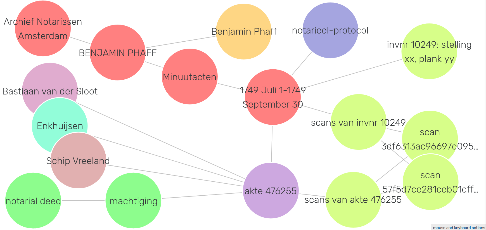

# Blauwdruk SHACL definitions

This folder contains 
* examples of archival descriptive data complying to the [Records in Contexts Ontology](https://www.ica.org/standards/RiC/ontology).
* constraints on a minimal viable data structure for Dutch archival description, defined in [SHACL](https://www.w3.org/TR/shacl/) shapes.
* shell-scripts for validating the examples to the shacl-shapes.

A basic introduction (Dutch) into Records in Contexts was published in [Archievenblad, april 2021, pp. 16-17](Artikel-RiC-Archievenblad-april-2021.pdf).

# Examples
We provide examples for resources of the classes rico:RecordSet, rico:Record and rico:RecordPart, various subclasses of rico:Agent and rico:Place. The files starting with 'saa5075' are a RDF representation of a part of the graph depicted in the article in Archievenblad, presented here:


# SHACL shapes
The turtle files, containing the SHACL shapes with constraints of a minimal viable data structure for Dutch archival description, contain a more detailed description (in Dutch) of the data structure by means of rdfs:label and rdfs:comment properties. With some small effort one can read the SHACL-files and interprete their consequences.

## SHACL validation
The SHACL files can be used in the [shacl-playground](https://shacl.org/playground/) or with CLI tool 'shacl' in Apache Jena to validate your data.

## Install Jena
[Jena](https://jena.apache.org/) is "a free and open source Java framework for building Semantic Web and Linked Data applications". You can download it [here](https://jena.apache.org/download/), unpack the tar or zip and place it on a convenient place on your system.

## Adding paths to JENA
You need to add the paths to the JENA-directory for your system to find the CLI-tools, as described [here](https://jena.apache.org/documentation/tools/).

e.g.
```
export JENA_HOME=/usr/bin/apache-jena/apache-jena-3.14.0
export PATH=$PATH:$JENA_HOME/bin
```

## Use CLI command 'shacl'
Jena contains the CLI command 'shacl' to validate data. It is described in more detail [here](https://jena.apache.org/documentation/shacl/).

# Test-scripts
The shell-scripts test-*.sh run tests on the available example files.
